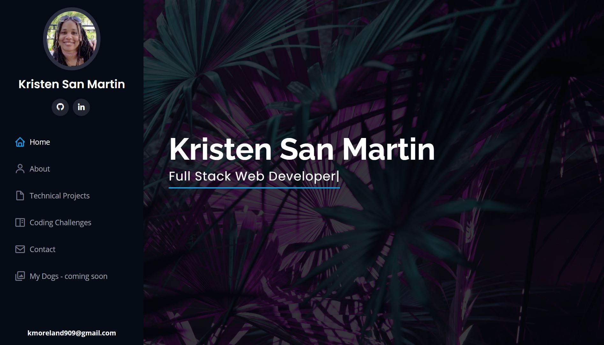
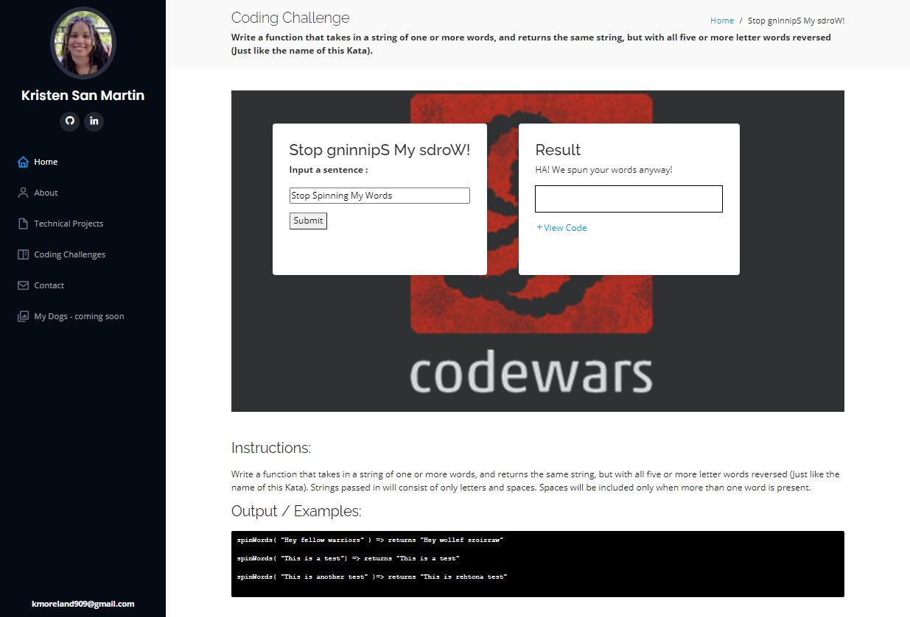

# KISMET-INC.github
**kis·met**  
/ˈkizmit,ˈkizˌmet/  
*noun*  
destiny; fate.

>  “The only person you are destined to become is the person you decide to be.”  
**― Ralph Waldo Emerson**


## Description
> *I chose **KISMET** not just for it's meaning but also as a meaningful shorthand to my name **KRISTEN SM***
> 
[Kismet-INC.github.io](https://kismet-inc.github.io/index.html) is a website to display my body of work in a clean professional manner. I was based on a Bootstrap template in order to be launched and ready to view in a timely manner post graduation. The HTML, and CSS in this website was generated by the code in my repository [Kismet-INC/portfolio-dev](https://github.com/KISMET-INC/portfolio-dev) which stores and manages the backend technologies that generated these files.

## Screenshots






## Installation

1. Clone the repository down to your local drive by opening up a terminal in the folder of your choice and type the code: 
```bash
git clone https://github.com/KISMET-INC/KISMET-INC.github.io.git
```
2. Double click the **index.html** to launch the website locally


## Support
Any questions or comments about this repository can be emailed to kmoreland909@gmail.com.

## Roadmap
As I get better and upgrade my projects or add new ones this website will be constantly updated to reflect that. Bookmark the deployment url for this site, KISMET-INC.github.io to see what I add to it in the future.

## Contributing
I am not accepting contributions to this project at this time.

## Authors and acknowledgment
Thank you to [BootStrapMade](https://bootstrapmade.com/) for supplying an easy to use template to launch and learn from.